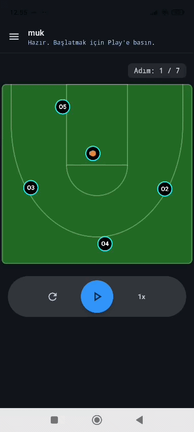
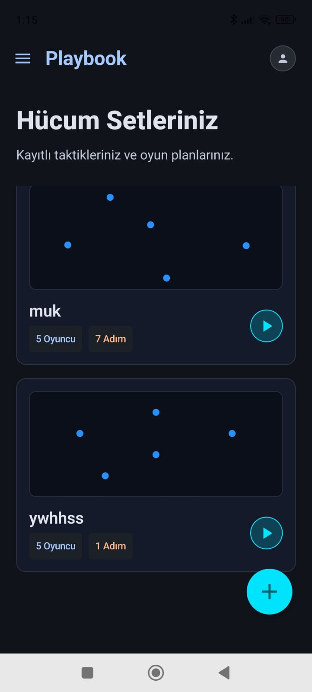
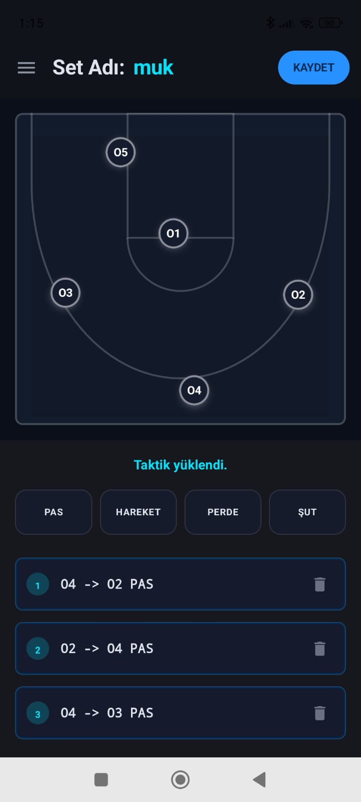
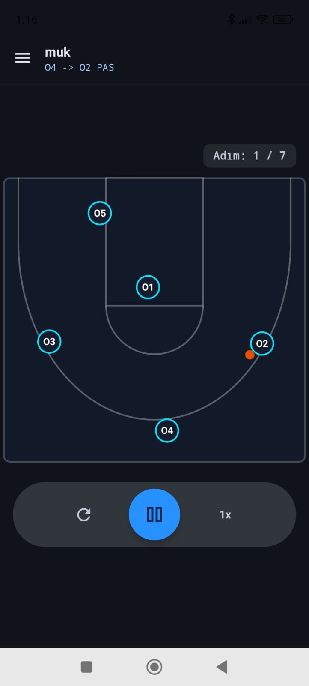
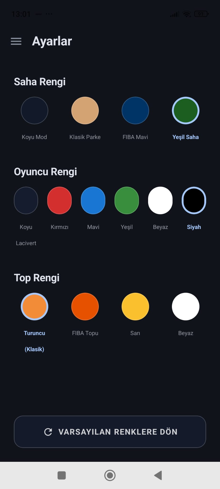

# 🏀 PlayBook - Basketbol Taktik Planlayıcı

PlayBook, basketbol antrenörleri ve oyuncuları için geliştirilmiş modern, çevrimdışı (offline-first) ve interaktif bir taktik çizim & animasyon uygulamasıdır. Klasik taktik tahtalarını dijitale taşıyarak setlerinizi adım adım oluşturmanızı ve bu setleri animasyonlu bir şekilde oynatarak oyuncularınıza göstermenizi sağlar.

## 🎯 Uygulamanın Amacı

Geleneksel antrenmanlarda taktik tahtası üzerinde set çizmek ve bunu oyunculara anlatmak genellikle zaman kaybına ve yanlış anlaşılmalara yol açabilir. PlayBook'un temel amacı bu süreci dijitalleştirerek **zaman kazanmak** ve **öğrenimi kolaylaştırmaktır**. 

Antrenörler, idman veya maç öncesinde kullanacakları hücum ve savunma setlerini uygulamaya önceden çizer ve kaydeder. Saha içinde oyunculara bu setleri statik çizgiler yerine **akıcı bir animasyon** olarak izletmek, oyuncuların (özellikle genç sporcuların) pas zamanlamalarını, kimin nereye koşması gerektiğini ve sahaya nasıl yerleşeceklerini çok daha hızlı ve net bir şekilde kavramalarını sağlar.

## 🌟 Özellikler

- **İnteraktif Taktik Tahtası:** Oyuncuları (O1-O5) sürükle-bırak yöntemiyle sahaya yerleştirin.
- **Detaylı Adım Yönetimi:** Pas (Pass), Koşu (Move), Perde (Screen) ve Şut (Shoot) gibi aksiyonları adım adım ekleyin.
- **Animasyonlu Oynatıcı:** Çizdiğiniz seti akıcı bir animasyon (60 FPS) ile izleyin.
- **Oynatma Kontrolleri:** Animasyonu duraklatma, başa sarma ve hız kontrolü (0.5x, 1x, 2x) özellikleri.
- **Yerel Veritabanı:** Tüm setleriniz cihazınızda güvenli bir şekilde (Room Database ile) çevrimdışı saklanır.
- **Modern Arayüz:** Koyu tema, neon "cyberpunk" renk paleti ve glassmorphism (cam) tasarımlarıyla göz alıcı bir UI.
- **Uyarlanabilir İkon & Splash Ekranı:** Android 12+ Splash Screen API ve Adaptive Icon destekli profesyonel açılış.

## 🛠️ Teknolojiler & Mimari

Uygulama modern Android geliştirme standartlarına uygun olarak inşa edilmiştir:

- **Dil:** [Kotlin](https://kotlinlang.org/)
- **Kullanıcı Arayüzü (UI):** [Jetpack Compose](https://developer.android.com/jetpack/compose) (%100 Declarative UI)
- **Mimari:** MVVM (Model-View-ViewModel)
- **Dependency Injection:** [Dagger Hilt](https://dagger.dev/hilt/)
- **Yerel Veritabanı:** [Room](https://developer.android.com/training/data-storage/room)
- **Asenkron İşlemler & State:** Coroutines, StateFlow

## 🎥 Uygulama Videoları

**Taktik Tahtası ve Animasyon:**
<br>


## 📸 Ekran Görüntüleri

<p align="center">
  
  
  
  
</p>

## 🚀 Kurulum

1. Repoyu klonlayın:
   ```bash
   git clone https://github.com/kullaniciadi/PlayBook.git
   ```
2. Projeyi **Android Studio** ile açın.
3. Gradle senkronizasyonunun bitmesini bekleyin.
4. Bir Android Emülatöründe veya fiziksel cihazınızda (Android 7.0+ destekli) çalıştırın.

## 💡 Gelecek Hedefleri (Roadmap)

- [ ] Savunma oyuncularının (X1-X5) eklenmesi.
- [ ] Setleri PDF veya Video olarak dışa aktarıp WhatsApp/Telegram üzerinden paylaşma.
- [ ] Setleri kategorilere ("Hücum", "Savunma", "P&R") ayırma.

## 📝 Lisans

Bu proje [MIT Lisansı](LICENSE) altında lisanslanmıştır. Dilediğiniz gibi kullanabilir ve geliştirebilirsiniz.
